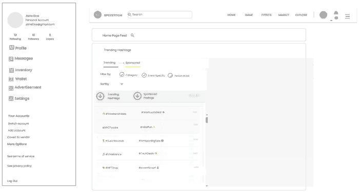
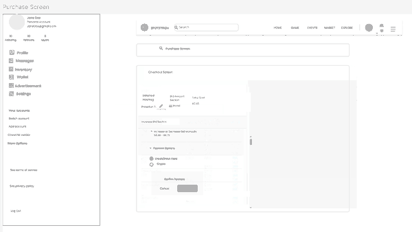
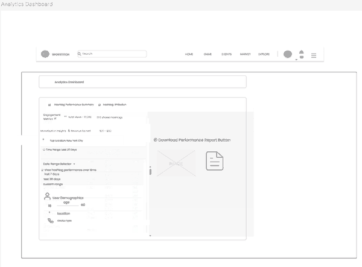
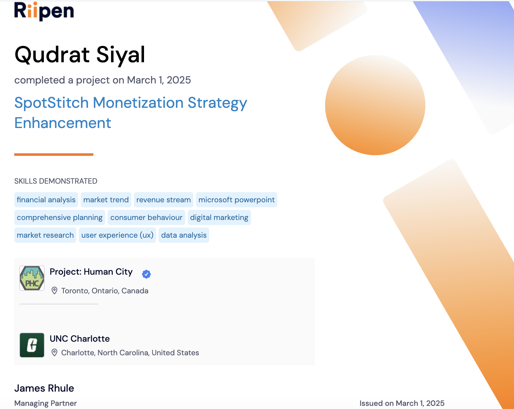

# SpotStitch Monetization Strategy Enhancement

### UX Design Internship Case Study — Spring 2025

A UX/product design case study focused on developing a monetization strategy for **SpotStitch**, an AR-based social media platform that connects users with local events and content.

**Role:** UX Design Intern  
**Course:** PROS 3000 — Professional Studies Internship  
**Institution:** UNC Charlotte  
**Project Partner:** Project Human City  
**Platform:** Riipen  
**Semester:** Spring 2025

## Project Links

- [View the interactive Figma prototype](https://www.figma.com/design/yZtiRfTs7RqdKRB4Ule4IR/SpotStitch-Monetization-Strategy-Enhancement?node-id=0-1&t=KOj46uyLXI7osQbM-1)
- [View the full UX Case Study Report](./UX%20Case%20Study%20Report.pdf)

## Project Overview

SpotStitch is an AR-based social media platform designed to connect users with local events and content. The goal of this project was to explore a sustainable monetization model using **purchasable and biddable hashtags** while maintaining a seamless user experience.

The project balanced two important goals:

- Creating revenue opportunities for the platform and participating businesses
- Maintaining an intuitive, non-intrusive experience for users

## Problem

The primary UX challenge was introducing monetization without negatively affecting user engagement. The project explored how businesses could purchase or bid on location-based hashtags while giving users an experience that felt integrated into the product rather than like traditional advertising.

## Research & Competitive Analysis

The project included competitive research into several existing digital advertising and monetization approaches, including:

- Instagram and TikTok advertising
- Snapchat AR filters
- Google Maps local business advertising

The research helped identify opportunities for combining location, augmented reality, social content, and sponsored hashtags.

## Design Process

An interactive Figma prototype was created for two primary experiences.

### User Flow

1. Discover trending hashtags
2. Explore purchasable hashtags
3. Purchase or bid on a hashtag
4. Receive purchase confirmation and analytics
5. Use the monetized hashtag within a post

### Vendor Flow

1. View the vendor dashboard
2. Purchase hashtags in different locations
3. Manage or override hashtag sales
4. Select hashtags through a map-based interface
5. Track transactions, revenue, and conversions

## Prototype Highlights

### Home Feed — Hashtag Discovery

The home feed helps users discover trending and sponsored hashtags, with filtering options for categories, events, and personalization.

### Hashtag Marketplace & Bidding

This prototype screen shows the post-purchase experience for a monetized hashtag, including the purchase summary, promoted hashtag integration, suggested hashtags, and access to performance statistics.

### Vendor Activity & Hashtag Management

The vendor-facing marketplace view presents available hashtags, demand and pricing information, instant-purchase and bidding options, and vendor activity areas for monitoring owned hashtags and performance.

### Purchase & Checkout Flow

The checkout flow presents the selected hashtag, bid amount, total cost, payment options, and a final confirmation step.

### Analytics Dashboard

The analytics dashboard gives vendors visibility into hashtag engagement, monetization, location, user demographics, and downloadable performance reporting.

## Usability Testing

Usability testing helped identify several opportunities for improving the design:

- Users found the bidding process intuitive but wanted clearer pricing indicators.
- Businesses requested competitor pricing comparison features.
- Clearer dashboard analytics improved the ability to track performance.

The feedback informed subsequent design improvements.

## Outcomes

The project resulted in:

- An interactive Figma prototype
- User and vendor journey flows
- A location-based hashtag monetization concept
- Usability-tested interface improvements
- A proposed monetization strategy for SpotStitch

## Skills Demonstrated

- UX Research
- User Experience Design
- UI Design
- Figma
- Prototyping
- Usability Testing
- Competitive Analysis
- User Flows
- Product Strategy
- Market Research
- Data Analysis
- Monetization Strategy
- Consumer Behavior

## Key Lessons

**Research informs design.** Competitive analysis helped identify opportunities to differentiate the monetization experience.

**User feedback improves products.** Usability testing revealed issues and opportunities that were difficult to identify during initial prototyping.

**Monetization should support the user experience.** Revenue-generating features work best when they feel integrated into the product rather than interrupting the user.

## Project Completion

This project was completed through Riipen in collaboration with Project Human City and UNC Charlotte.

## About This Project

This project was completed during Spring 2025 as part of my UX design internship experience through UNC Charlotte's **PROS 3000 Professional Studies Internship** course.

It provided practical experience applying human-computer interaction and UX design principles to a real-world product and business challenge.
